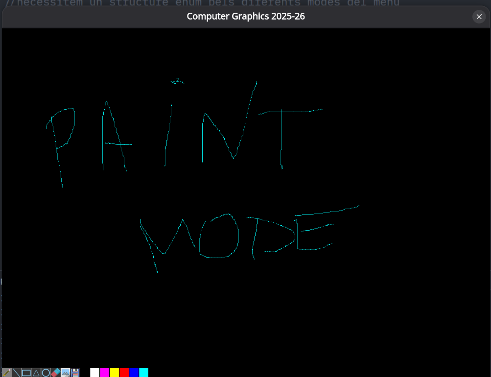
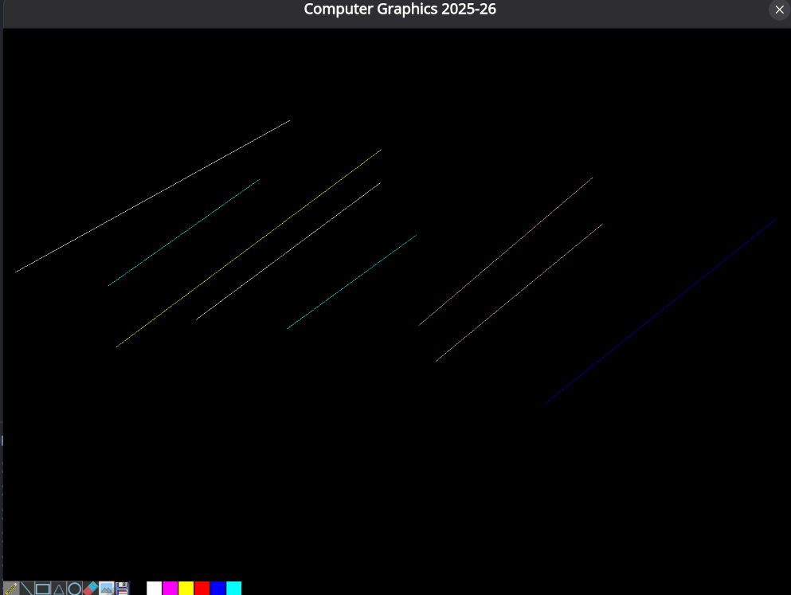
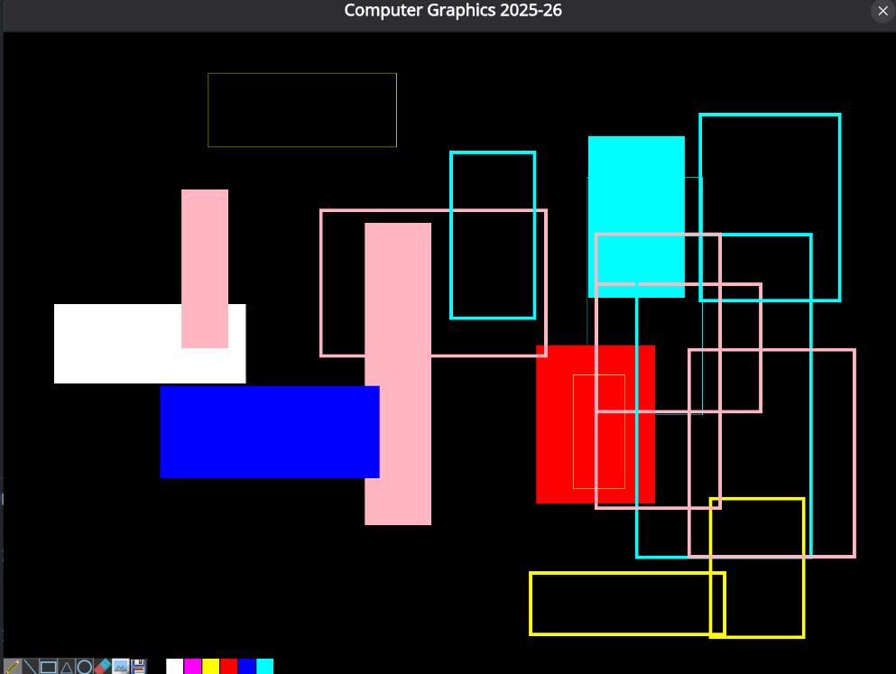
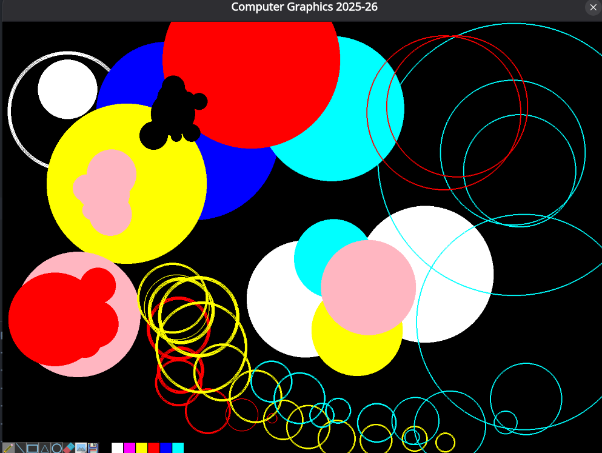
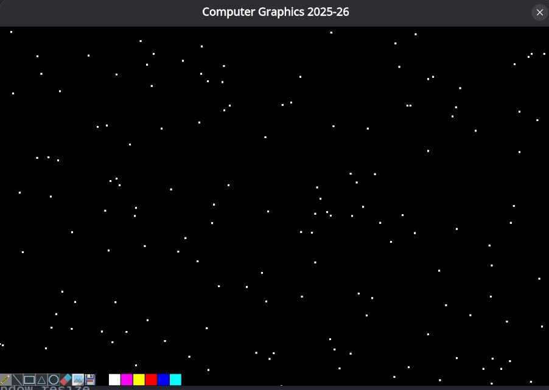
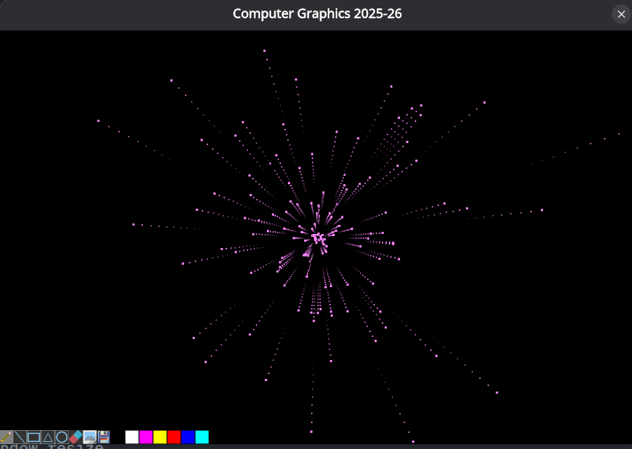
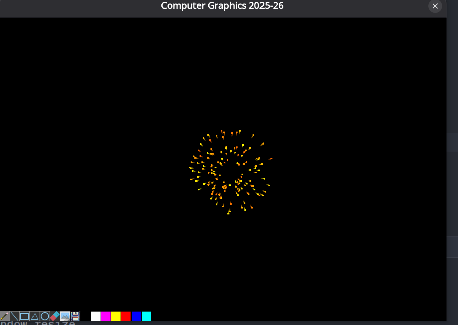
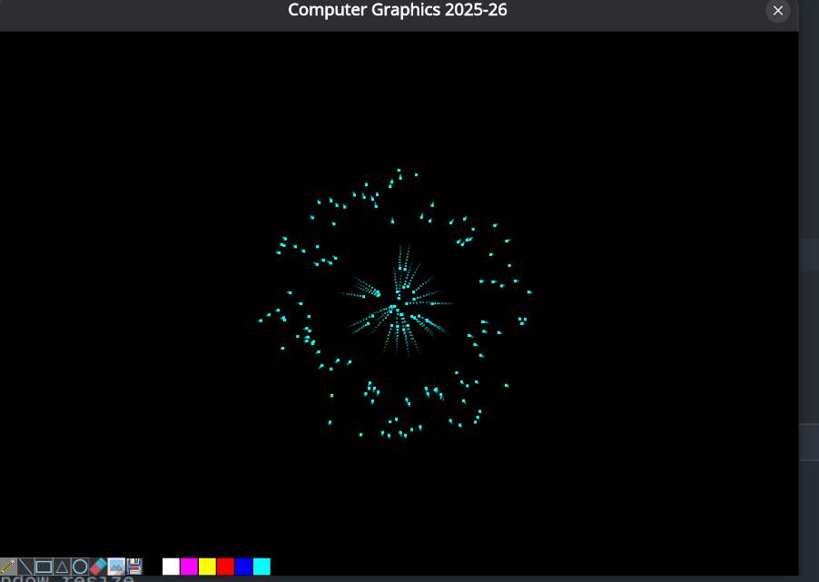

# Computer Graphics - LAB1
## Paint Application & Particle System

Aquest projeecte implementa una aplicacio de dibuix estil Paint amb primitives ii amb unes mode de animacions visuals.



---

## Funcions Implementades de l'enunciat!!

### 1. Primitives Grafiques (image.cpp)

#### `DrawLineDDA(int x0, int y0, int x1, int y1, const Color& c)`
Dibuixa una linia entre dos punts utilitzant l'algoritme DDA

#### `DrawRect(int x, int y, int w, int h, const Color& borderColor, int borderWidth, bool isFilled, const Color& fillColor)`
Dibuixa un rectangle amb suport per:
- Contorn amb gruixx variable amb interactivitat -/+
- Omplert opcional amb color diferent amb interactivitat F

#### `DrawTriangle(const Vector2& p0, const Vector2& p1, const Vector2& p2, const Color& borderColor, bool isFilled, const Color& fillColor)`
Rasteritza un triangle utilitzant la teccnica Active Edge Table (AET) amb `ScanLineDDA`.

#### `DrawCircle(int x0, int y0, int r, const Color& borderColor, int borderWidth, bool isFilled, const Color& fillColor)`
Dibuixa un cercle amb l'algoritme Midpoint Circle referenciat als slides.

#### `DrawImage(const Image& image, int x, int y)`
Copiaa una imatge al framebuffer a la posiciio especificada.

---

### 2. Mode Paint (Tecla 1)

L'aplicacio permet dibuixar amb diferents eines:

| Eina | Icona | Descripcio |
|------|-------|------------|
| Llapis |  | dibuixar amb Llapis Mode |
| Linia |  | Clic i arrossega per dibuixar linies Rectes |
| Rectangle |  | Clic i arrossega per crear Rectangles |
| Triangle |  | 3 clics per definir els 3 vertexs dun Triangle |
| Cercle |  | Clic i arrossega per definir radi duna circumferencia|

**Exemples de cada eina:**

| Linies | Rectangles |
|--------|------------|
|  |  |

| Cercles | 
|---------|
|  |

---

### 3. Mode Animacio (Tecla 2)

Sistema de particules amb 4 animacions diferents. Prem la tecla `2` repetidament per canviar entre elles:

| Animacio | Captura | Descripcio |
|----------|---------|------------|
| **Snow** |  | Particules blanques caient com neu |
| **Starfield** |  | Efecte velocitat de la llum amb cues |
| **Explosion** |  | Particules de foc sortint del centre |
| **Implosion** |  | Particules convergint al centre |

---

### 4. Interactivitat (Tecles)

| Tecla | Accio |
|-------|-------|
| `1` | Mode Paint |
| `2` | Mode Animacio (canvia entre animacions) |
| `F` | Toggle Fill Shapes (omplir figures ON/OFF) |
| `+` | Incrementar gruix del contorn |
| `-` | Reduir el gruix del contorn |
| `ESC` | Sortiir de l'aplicacio |

---

### 5. Menu de Colors

Seleccio de colors disponibles a la barra inferior:

| Negre | Blanc | Rosa | Groc | Vermell | Blau | Cyan |
|-------|-------|------|------|---------|------|------|
|  |  |  |  |  |  |  |

---

### 6. Funcions Addicionals

| Boto | Icona | Funcio |
|------|-------|--------|
| Esborraar |  | Neteja el canvas |
| Guardar |  | Guarda la imatge en format TGA |
| Carregar |  | Carrega una imatge TGA |

---

## Estructura del Projecte

```
src/framework/
├── application.cpp   # gestio d'events i renderitzacios
├── application.h     # Definicio classes Application, Button, enums
├── image.cpp      # Implementacio primitives grafiques 2.1.X
├── image.h     # Definicio classe Image
├── ParticleSystem.cpp # Sistema de particules i animaacions
└── ParticleSystem.h   # Definicio classe ParticleSystem

res/images/
├── pencil.png, line.png, rectangle.png, triangle.png, circle.png #buttons de les eines
├── black.png, white.png, pink.png, yellow.png, red.png, blue.png, cyan.png    #Button Colors
├── eraser.png, save.png, load.png  # Button funcitnoalities
├── Mode1.png  #Screenshot
├── LineMode.png, RectangleMode.png, CircleMode.png  # Captures eines
└── SnowMode.png, StarfieldMode.png, ExplosionMode.png, ImplosionMode.png  #Animations modes
```

## Autor

**Arnau R.** - Universitat Pompeu Fabra (UPF)  
Computer Graphics 2025-26

---

## Referencies

- Algoritme DDA: [Wikipedia](https://en.wikipedia.org/wiki/Digital_differential_analyzer_(graphics_algorithm))
- Midpoint Circle: [Wikipedia](https://en.wikipedia.org/wiki/Midpoint_circle_algorithm)
- Active Edge Table: Apunts de classe
- README amb llenguatge de marcat IA
